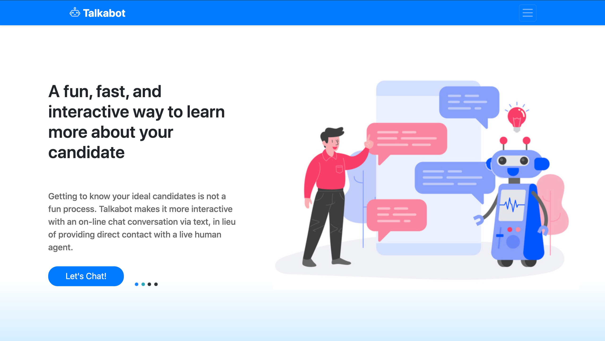
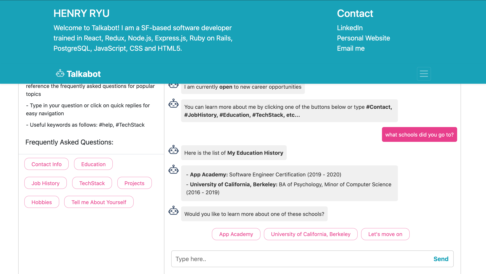
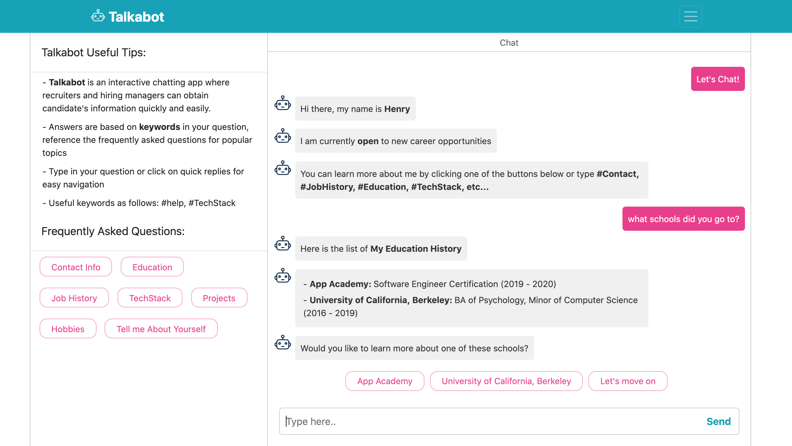

# README

## Talkabot

* Talkabot is a chatbot designed for recruiters and hiring managers to learn more about me as a candidate

* Technologies used:
  * Node.js
  * JavaScript
  * Botkit.ai
  * Bootstrap.js
  * SCSS / HTML5


## Installation and Usage

* Installation
  * Download ZIP or clone MintyChatBot repo
  * In root directory run `npm install` to download dependencies
  * Once finished type `npm start` into terminal which will start Webpack
  * You can now navigate to `http://localhost:3000/` to view a local version of Talkabot
  * If you want to test it out with your own information replace the values in rawData.js and projects.js objects

* Usage
  * Landing page requires button press to activate chatbot
  * Conversations are led by #keywords, users can type in their own questions or click on suggested topics
  * At any time a user can type #help to get a selection of topics to move the conversation forward


## App Overview

* Landing Page overview:
  * Vibrant colors and bold text draw in user
  * Button press was necessary to manipulate DOM before entering chat allowing us to circumvent the chrome autoplay ban and make notification sound effects for initial message (<---at least 2 hours were lost on this bug)
 


* Dynamic Navbar overview:
  * Talkabot logo doubles as link to landing page and chat reset
  * On click of burger icon the navbar extends down with animation and reveals vital info
  * Displays name, description, and hotlinks to portfolio and social sites
  * Embedded 'email me' allows users to reach out easier



* Chatbot overview:
  * Greets user upon joining the chat 
  * Useful information and tips are displayed readily visible to user to left of chat
  * Frequently asked questions are an easy way to find your next conversation
  * Suggests new topics when there is no longer information available on current topic
  * Every message comes with a non-obtrusive notification sound so you never miss a message
  * Typing icon lets you know another message is coming for the Talkabot




### Notifications

* Utilized HTML5 <audio> tag to host a short mp3 clip

```
  <audio class="audio-element">
      <source src="./assets/bubble_pop.mp3">
      </source>
  </audio> 
```
* Inside of `Client.js` file we call `.on('message')` to listen for every incoming and outgoing message
* Then use vanillaJS to grab the audio element and call `.play()` on it

```
  that.on('message', function (message) {

      const sound = document.getElementsByClassName(
          "audio-element"
      )[0];

      sound.play();
      
      that.renderMessage(message);

  });
```

### Typing Icon

  * Utilized JavaScript's `setTimeout()` function to delay the bot from sending messages instantly
  * We begin by instantiating a 'typing' message immediately after a question is submitted
  * setTimeout will not work without the use of `changeContext()`
  * The first message is delayed for 1 second and after it is sent a new typing icon is loaded in for the next message if there is one

```
  await bot.reply(message, { type: 'typing' });
    
  setTimeout(async () => {

    await bot.changeContext(message.reference);
    await bot.reply(message, `Here is the list of <Strong>My Education History</Strong>`);

    await bot.reply(message, { type: 'typing' });

  }, 1000)

  setTimeout(async () => {

    await bot.changeContext(message.reference);
    await bot.reply(message, {
      text: `${listOfInsitutions.map(school =>
        `<div>- <strong>${school.institutionName}:
        </strong>${school.degree} (${school.startDate.slice(0,4)} - ${school.endDate.slice(0,4)})</div>`)
        .join('')}`
    });

    await bot.reply(message, { type: 'typing' });

  }, 3000)
```